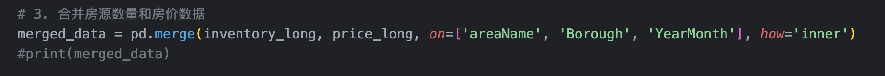
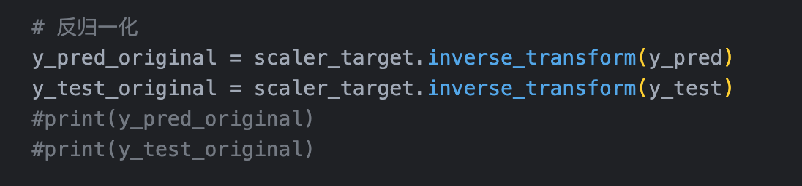

# Week 01

我在另一门课 UX design 上，设计了一款基于 LLM 和 RAG 的找房 App，目前我们可以根据用户提供的信息进行多样化的房源推荐，但是，我们目前无法预测房价的走势。房价的走势非常关键，不仅可以帮助租户确定入住的时间，也可以帮助房主根据供需关系更好地确定租金价格。

因此我在这一步的选题非常明确，就是针对于纽约市的所有社区的租金进行时间序列的预测。

我在数据集上采用了 streeteasy 公开的数据集，数据集包括 2010 年之后，纽约市全部 155 个社区的租金中位数，以及这些社区每个月空置的房间数量，数据集的格式无法直接使用，并且包含一些空值，因此需要一些预处理和数据合并，将其拆分为训练和测试数据也是非常有意义的。评估方法，我将使用比较传统的评估方式，也就是评估预测结果和原始结果的均方误差，平均绝对误差等等。

我想要探索的是：如何通过入住时间、空置房间数量、与社区来预测房租价格。

因为入住时间是一个时间序列，空置房间数量与社区并不是时间序列。

# Week 02

因此首先我们要进行数据的预处理。我从 Streeteasy 的开放数据网站上下载得到这样两个表格，他们分别记录了不同时间下，各个社区的空置房间数量和价格中位数：

下载的链接在：
https://streeteasy.com/blog/download-data/

我总共有 14000+条记录，格式是 excel，后续我会把它转换为dataframe 格式

去除空值之后我大约有 10000 条数据

我有特征和结果变量，特征变量有：areaName, Year, Month, InventoryCount, 结果变量有：Price

下载下来的原始数据是：

要处理这些数据，我们需要将时间变为一个变量，因此需要将时间变成表格中的一列，处理完就是下面这样：

然后，我们将 price 和 inventory 的表格合并，并去除其中包含空值的行。

最终得到上面这个数据集。

除此之外，我还需要将数据源的时间特征拆解为 Year 和 Month

并且需要将社区名称进行编码，只有数字才可以被输入模型

当然，和我们之前所有的作业一样，我们需要将所有的变量归一化。到这一步，我们的数据就准备好了！

【Note】：尊敬的 Hersan 教授，抱歉，我没有保存每周的 jupyter notebook 版本，但是您可以在我的最终 notebook 中找到上面的所有代码，一部分代码可能被注释了，但您一定能找到。

# Week 03

因为我的数据是一个跟随时间序列变化的预测，因此我想使用LSTM 模型。这个原因是 RNN 这样的模型，在处理长序列的数据时，容易忽视远距离的时间依赖关系，也就是会出现梯度消失现象。
而 LSTM 有记忆单元，我们可以控制 seqence 的长度，来控制模型不要忘记某个特定特征的历史信息。

因此，我开始建构我的模型。这个模型将输入参数分为两个部分，第一个部分是序列特征，也就是我们希望模型能够长期保留的特征，而第二部分是固定特征，也就是不会随着时间而改变的一些特征，包括areaName 和 InventoryCount.

我希望对于序列数据，使用 LSTM 处理；对于固定特征，使用Dense 进行静态特征处理，然后在高层级进行特征融合。就像这样：

具体的做法的话，我们开始需要生成时间序列的数据和目标值的结构：

这边有一个 seq_length，这就是LSTM 模型中的记忆的长度，我们每次都会截取 seq_length个连续时间节点的数据，而目标值，是seq_length 个时间节点之后的值。

为了统一输入特征的 size，我们需要去掉前 seq_length 行：

最后，我们需要构建两个输入层，分别是时间序列和静态特征的输入层与输出层

然后，我们需要融合两个部分的特征值，使用这个特征值进行输出；并且，构建输入与输出之间的关系。

最后，使用切分好的数据集，进行模型的训练，同时输入两个类型的特征。

【Note】：尊敬的 Hersan 教授，抱歉，我没有保存每周的 jupyter notebook 版本，但是您可以在我的最终 notebook 中找到上面的所有代码，一部分代码可能被注释了，但您一定能找到。

# Week04

在上周的输出后，我忘记了要进行反归一化：

在最后，完成归一化之后，我可以直接画图进行输出，并输出评价指标。

但是，结果很不好.......

我们可以看到散点图中，预测值和真实值的偏差非常大。接着，我就开始找问题：

**第一个问题：**

我在编码月份的时候，使用了和社区名称一样的编码器，这是错误的。

除此之外，我还在网上找到了一个对于月份的更好的编码方式——使用 sin和 cos。

**第二个问题：**

原先的特征划分有问题！

在调整过后，我们可以得到一个预测准确率接近百分百的模型。

结果是：当 epoch_size=30,seq_length=10 时，模型达到最佳状态，平均预测价格的偏差在 17 美金左右。

