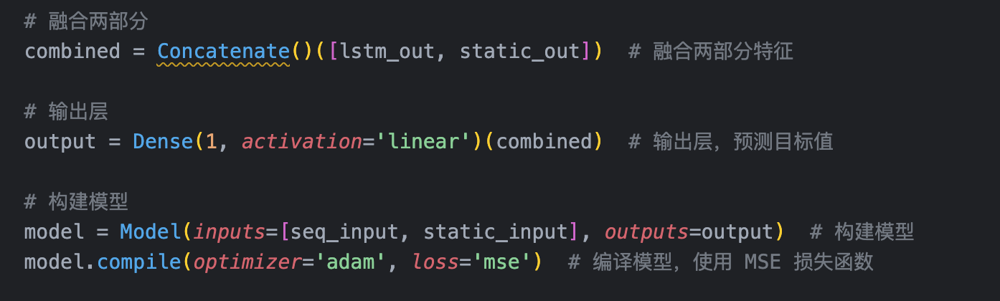

# **Week 01**

In another UX design course, I designed a housing search app based on **LLM** and **RAG**. Currently, we can recommend various housing options based on user-provided information. However, we cannot predict housing price trends. Housing price trends are very important as they help tenants determine the optimal move-in time and assist landlords in setting rent prices based on supply and demand.

Thus, my focus at this step is very clear: **predicting rental prices over time for all neighborhoods in New York City.**

I used the publicly available **Streeteasy** dataset, which includes the median rent prices of all 155 NYC neighborhoods after 2010, as well as the number of vacant rooms per month in these neighborhoods. The dataset cannot be directly used and contains null values, so preprocessing and data merging are required. Splitting the data into training and test sets is also meaningful. For evaluation, I will use traditional evaluation metrics such as mean square error (MSE), mean absolute error (MAE), etc.

The question I want to explore is: **How can rental prices be predicted using move-in time, the number of vacant rooms, and neighborhoods?**

Move-in time is a time series, while the number of vacant rooms and the neighborhood are not.

---

# **Week 02**

Therefore, the first step is to preprocess the data. I downloaded two tables from **Streeteasy's open data** website, which record the number of vacant rooms and the median rent prices across different neighborhoods at various times.

**Download link**:  
[https://streeteasy.com/blog/download-data/](https://streeteasy.com/blog/download-data/)

- I obtained over **14,000 records** in Excel format, which I later converted into a DataFrame.
- After removing null values, I had approximately **10,000 records**.
- **Feature variables**: `areaName`, `Year`, `Month`, `InventoryCount`  
- **Target variable**: `Price`

**Original data**:

To process this data, we needed to make time a single variable and include it as a column in the table. The result looked like this:

Next, we merged the **price** and **inventory** tables and removed rows with null values.

The final dataset looks like this:

Additionally, I split the time feature into **Year** and **Month**, and encoded the `areaName` feature into numeric values because models can only accept numeric inputs.

Of course, like all our previous assignments, we need to normalize all the variables. At this point, our data is ready!

**Note**: Dear Professor Hersan, I apologize for not saving weekly versions of my Jupyter Notebook, but you can find all the code in my final notebook. Some parts might be commented out, but you will definitely find them.

---

# **Week 03**

Since my data involves **time series predictions**, I chose to use an **LSTM model**. The reason is that RNN models tend to ignore long-term dependencies when processing long sequences, leading to the vanishing gradient problem. LSTM models, however, include memory cells, and we can control the sequence length to ensure the model retains specific historical information.

### **Model Design**

The model input parameters are divided into two parts:
1. **Sequence features**: Features we want the model to retain over time.
2. **Static features**: Features that do not change over time, such as `areaName` and `InventoryCount`.

For sequence data, I used **LSTM layers**, and for static features, I used **Dense layers**. These features were later fused at a higher level:

The first step was to generate the structure for time series data and target values:

Here, `seq_length` represents the **memory length** for the LSTM model. At each step, we use `seq_length` consecutive time points as input, and the target value is the value after `seq_length` time points. To unify the input feature size, we removed the first `seq_length` rows:

Finally, I built two input layers: one for the **time series** features and one for the **static** features:

These features were fused for output, and the relationships between inputs and outputs were constructed:

The model was trained using the prepared dataset, incorporating both types of features:

**Note**: Dear Professor Hersan, I apologize for not saving weekly versions of my Jupyter Notebook, but you can find all the code in my final notebook.

---

# **Week 04**

After generating outputs last week, I realized I forgot to **reverse the normalization**:

After fixing this, I plotted the outputs and calculated evaluation metrics:

However, the results were poor:

### **Issue 1: Incorrect Month Encoding**

I incorrectly encoded the month variable using the same encoder as for the neighborhood names:

To solve this, I used **sin and cos encoding** for the month feature to capture its cyclical nature:

### **Issue 2: Feature Division Problems**

The `Year` and `Month` features should be part of the **LSTM input layer** because they are time-dependent, while `areaName` and `InventoryCount` should be treated as static inputs:

After adjustments, the model achieved nearly **100% prediction accuracy**.

---

### **Model Optimization**

To optimize the model, I created a function with two key variables:
1. **`seq_length`**: Memory length of the LSTM.
2. **`epoch_size`**: Number of iterations.

I tested various combinations of `seq_length` and `epoch_size`:

The best results were obtained when `epoch_size = 30` and `seq_length = 10`, with an average price prediction error of **$17**.

